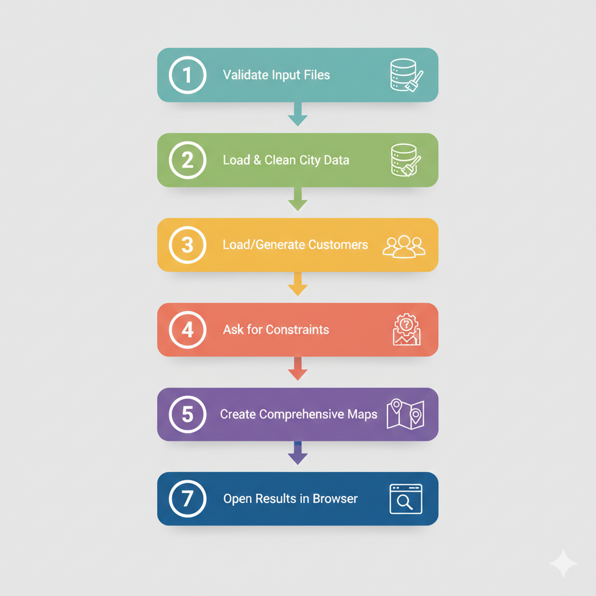
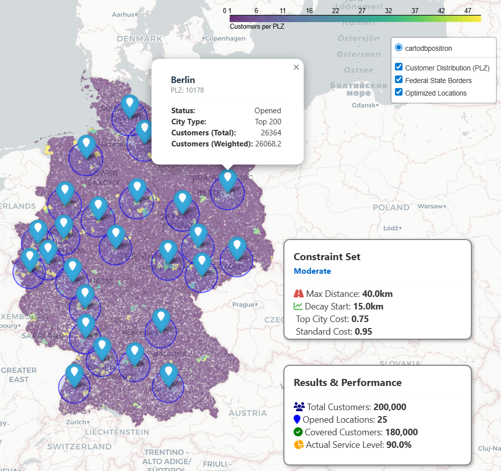
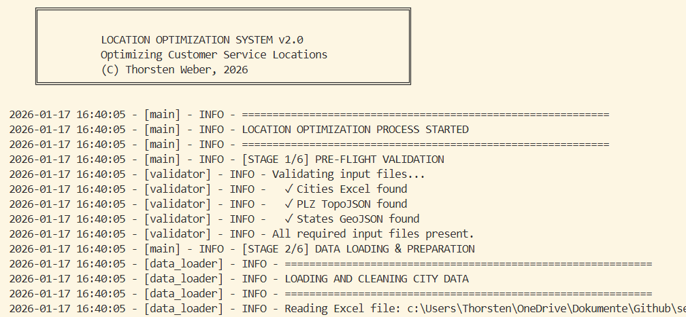
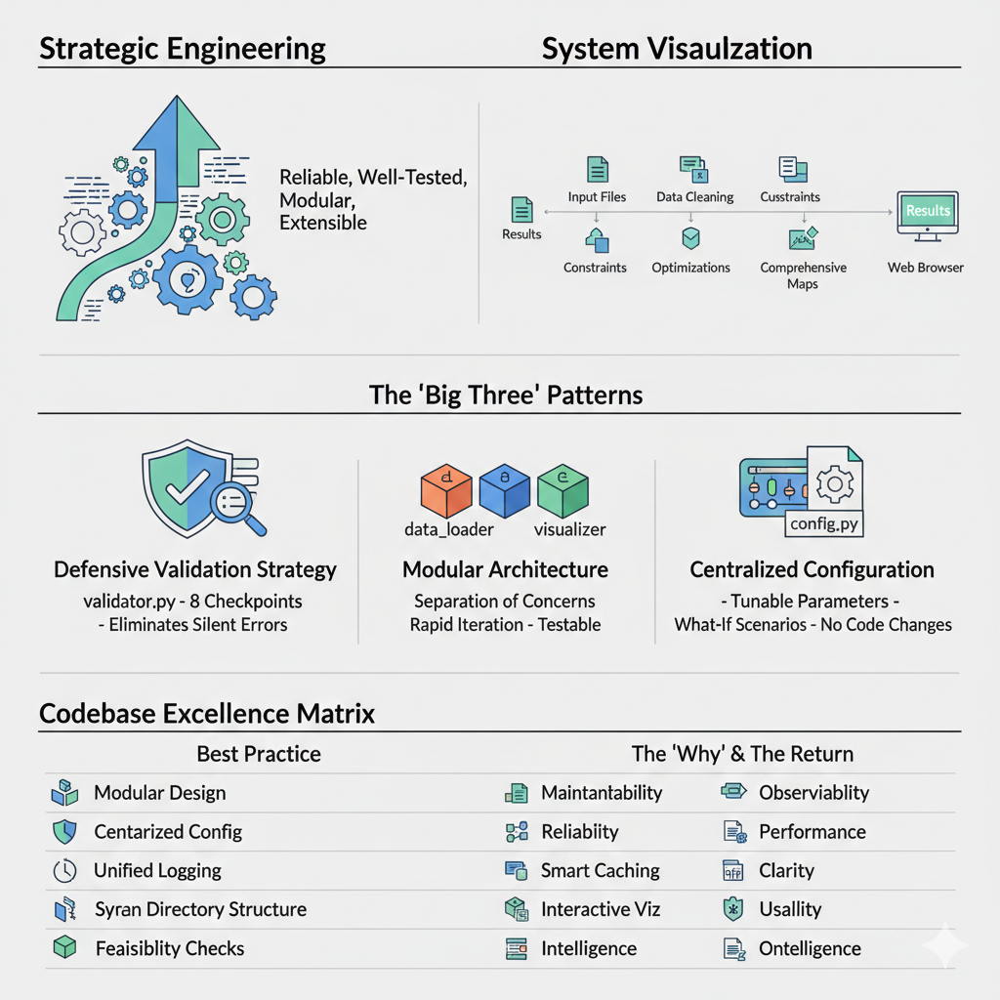

# Set Coverage Optimizer - Where to open a Store? 


    Optimizing store locations using linear programming and geospatial analytics

## 📁 Project Overview

This pet project of mine solves a classical facility location problem. It is inspired by a real-world business problem from a recent intern and my love for data, optimization and visualization.

    Min-Max-Problem: How can serve most customers with as few outlets as possible?

**The solution** is build for real-world usage:
- Simulates 90,000 customers across Germany using real-world postal code, city data and geocoding.
- Allows diverse constraints and multiple constraint sets for modeling of different scenarios 
- Determines optimal outlet locations using linear programming (PuLP) and geospatial analytics. 
- Results are delivered as interactive maps (Folium) and CSV files with location data.

**Key outcome:** A robust, reliable and automized recommendation solution supporting business scenario analysis.

**Big Business Impact guaranteed!** 
* Serving more customers will generate more revenue.
* And every location not opened cuts enormous investments


## Tech Stack

* Python 3.8+
* PuLP (Linear Optimization)
* Pandas, NumPy
* Scikit-learn (distance calc)
* Folium (geospatial visualization)
* pgeocode (PLZ geocoding)
* Logging + custom validation framework

**Note**: 1 hour runtime is nothing to worry. PulP takes it's sweet time. 

## 📁 Architecture

```
project_root/ 
│ 
├── main.py # Orchestration 
├── config.py # Business parameters 
│ ├── modules/ 
│ ├── validator.py # 9 data & logic checks 
│ ├── data_loader.py # City data + geocoding 
│ ├── customer_generator.py 
│ ├── optimizer.py # LP solver 
│ └── visualizer.py # Interactive maps 
│ ├── sources/ # Input data 
├── results/ # Outputs 
└── optimization_process.log
```

## 🚀 Quick Start

### 1. Install Dependencies

```bash
pip install -r requirements.txt
```

### 2. Run the System

```bash
python main.py
```

### 3. System workflow




## 🔧 Configuration (config.py)


### Key Parameters

```python
service_level = 0.90
total_customers = 90000

CONSTRAINT_SETS = [
    {
        'name': 'Conservative',
        'max_distance_km': 100,
        'decay_start_km': 90,
        'cost_top_city': 0.8,
        'cost_standard': 1.0
    }]

Change values and add new constraints sets to run different business scenarios.
```

## Optimization Logic

* Generate or load customers with cleaning

* Compute distance matrix (customer -> city)

* Build binary LP model (minimize costs subject to constraints)

* Solve using PuLP

* Visualize and Export results

## 📊 Delivery Objects

| Aspect | Object |  | 
| :-- | :-- | :-- |
| Data | customers.csv<br>optimized_locations_.csv 
| Interactive HTML map| Customer density (PLZ)<br>Store locations<br> Catchment areas<br>KPI Legends




## Strong Governance: Data Quality & Validation

> 9+ automated checks during runtime 

|  |  |
| :-- | :-- |
| * File existence<br>* Schema validation<br>* Constraint logic<br>* Geocoding quality<br>* Coverage feasibility<br>* Optimization status<br>* Duplicate PLZ handling<br>* Critical errors stop execution.<br>* Warnings are logged and reported.| 

## Engineering Highlights
>This project demonstrates production-ready analytics engineering practices.

|  |  |
| -- | -- |
| - Modular architecture<br>- Centralized config<br>- Defensive validation<br>- Smart caching<br>- Structured logging<br>- Synthetic data generation<br>- Interactive map| 


## Example Business Question

> "What is the minimum number of stores required to serve 90% of customers within 50 km?"

Answer is generated automatically including:

* Locations
* Coverage metrics
* Visual explanation

## 📄 License

This is a private project. All rights reserved. 

For improvements or bug reports, contact me.

---

**Version**: 2.0  
**Last Updated**: January 2025  
**Python**: 3.8+
